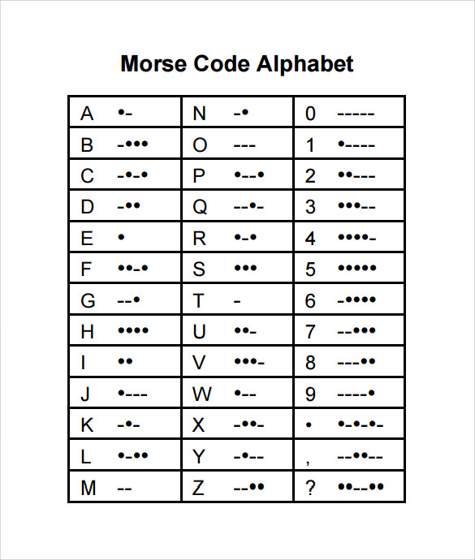
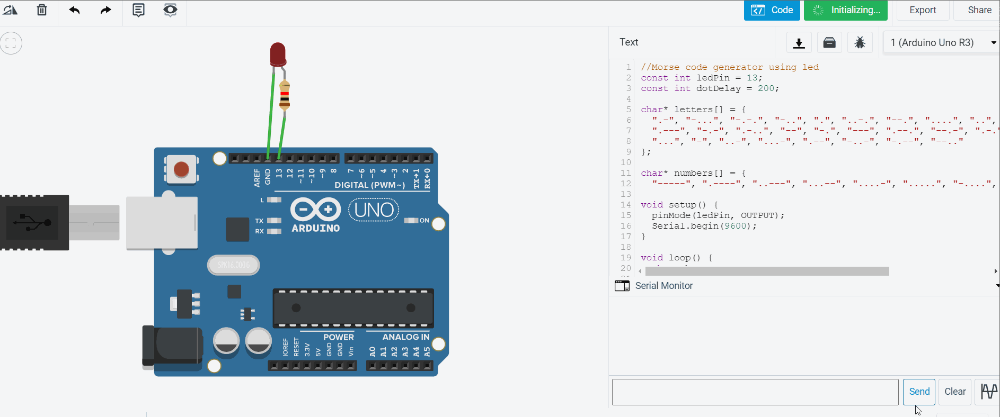

# Morse code Generator
Based on the input given in serial monitor
Below is the Morse code for different letters.

The ATMega is programmed to blink the LED at pin 13 as per the pattern of word typed in serial monitor input.

